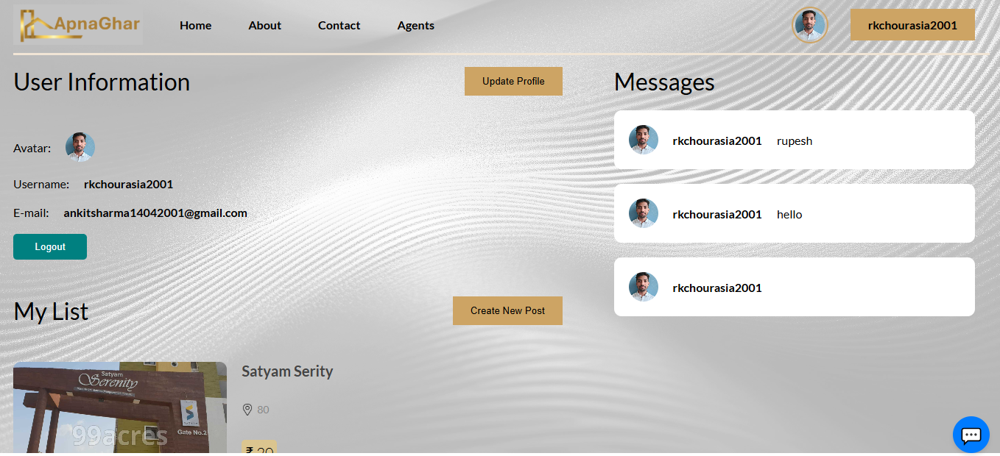

# ApnaGhar.com 🏠

**ApnaGhar.com** is a home rental platform designed to make renting properties seamless and efficient. It provides users with a range of features to manage property listings, bookings, and recommendations, all powered by modern web technologies.

---

## 🚀 Features

- **Authentication**: Secure Sign Up & Log In using JWT and Bcrypt.
- **Property Management**:
  - Create and manage detailed property listings.
  - Upload, delete, drag & drop photos.
- **Search & Recommendations**:
  - Search for properties by keyword and category.
  - Personalized property recommendations.
- **Booking System**:
  - Wishlist management for favorite properties.
- **Modern UI**:
  - Built with Material UI and SCSS for a responsive and user-friendly interface.
- **Real-Time Communication**:
  - Integrate real time message chat using socket.io
  - Integrated chatbot using Dialogflow ES.
  
---

## 🛠️ Tech Stack

- **Frontend**: React, Redux, Sass (SCSS), Material UI
- **Backend**: Node.js, Express.js
- **Database**: MongoDB with Mongoose
- **Authentication**: JSON Web Token (JWT), Bcrypt
- **AI Integration**: Dialogflow ES for chatbot
- **State Management**: Redux
- **Real-time Chat**: Socket.io
- **Other Tools**: Cloudinary for photo storage

